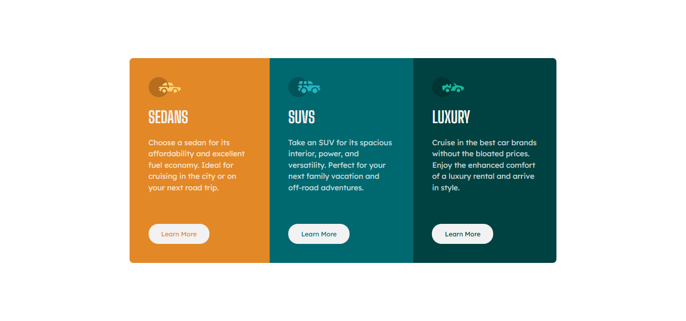
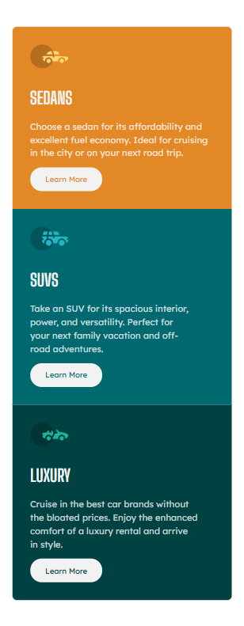

# Social Links Profile 🚗   

A responsive and accessible card component built using HTML, CSS, and Flexbox. This project is a solution to the Frontend Mentor challenge - a 3-column preview card component challenge and focuses on clean design, structured layout, and scalable styling.

## 🚀 Live Demo  
🔗 [View Project](https://bhavikthakur.github.io/3-column-preview-card/)  

## 📸 Preview  
  
  
  

## 📌 Features  
✔️ Clean and modern UI  
✔️ Fully responsive on all screen sizes  
✔️ Smooth hover effects on buttons  
✔️ Optimized for performance and accessibility  

## 🛠️ Built With  
- **HTML5**  – Semantic structure for better accessibility  <br>
- **CSS3 (Flexbox, Responsive Design)**    <br>
- **Google Fonts (Big Shoulders Display and Lexend Deca)**    <br>
- **Mobile-first-approach** - Fully responsive for all devices

  
## 📂 Folder Structure  
/3-column-preview-card     <br>
│── /css  <br>
│   ├── reset.css   # Resets default browser styles <br>
│   ├── styles.css  # Main styling file <br>
│   ├── media.css   # Responsive styles <br>
│── /images        # Contains all icons and assets <br>
│── index.html     # Main HTML structure <br>
│── README.md      # Documentation <br>


## 🔧 Setup & Usage  
1. Clone this repository:  
   ```bash
   git clone https://github.com/YOUR_GITHUB_USERNAME/social-links-profile.git    
2. Open index.html in your browser. 

## 🔓 Challenges and Learnings  
Implementing a flexbox-based layout while keeping it scalable. <br>
Ensuring typography remains consistent across different screen sizes. <br>
Managing CSS variables for color and spacing consistency.  <br>


## 🤝 Connect With Me  
👨‍💻 GitHub: [bhavikthakur](https://github.com/bhavikthakur)  <br>
💼 LinkedIn: [Bhavik Thakur](https://www.linkedin.com/in/bhavik-thakur/)  <br>
🐦 Twitter: [Bhavik Thakur](https://x.com/BhavikkThakur)  <br>
